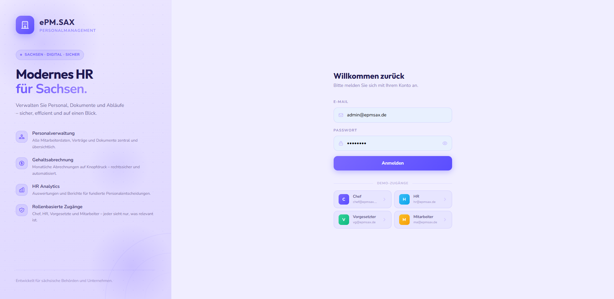
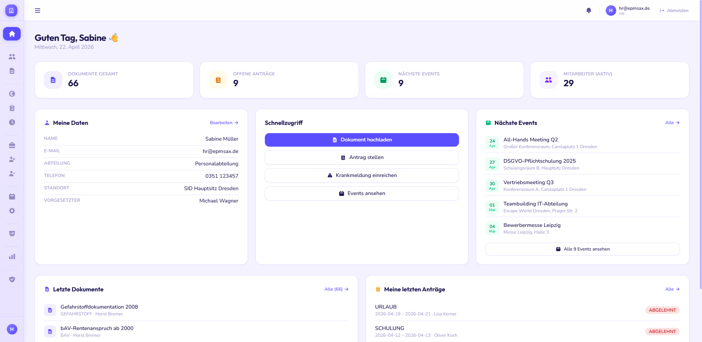
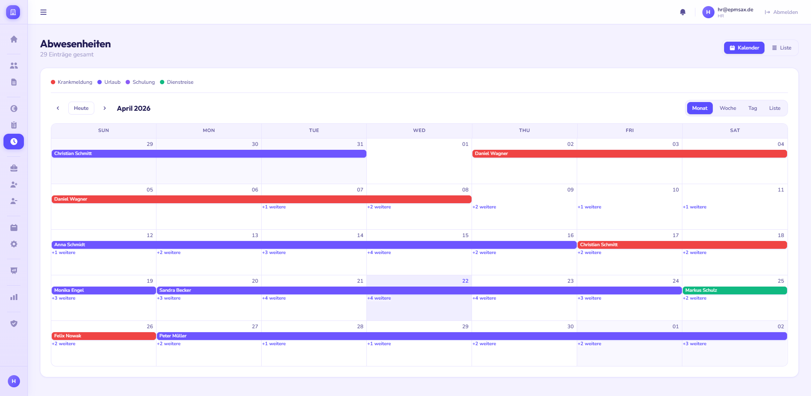
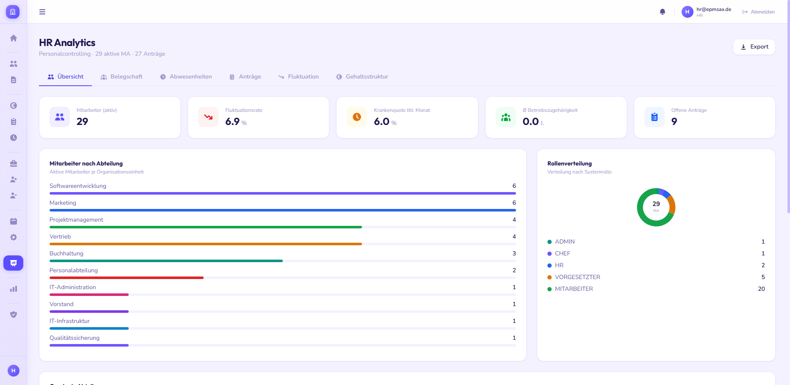
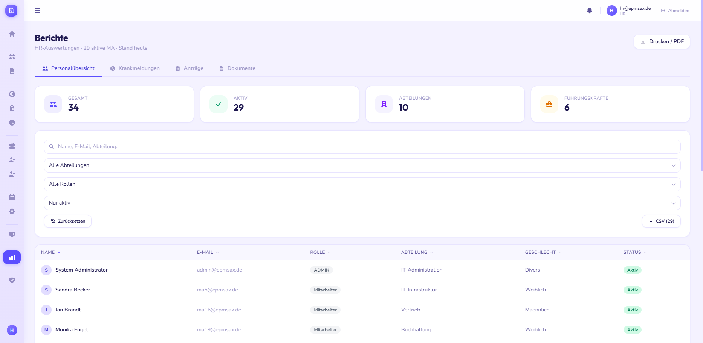
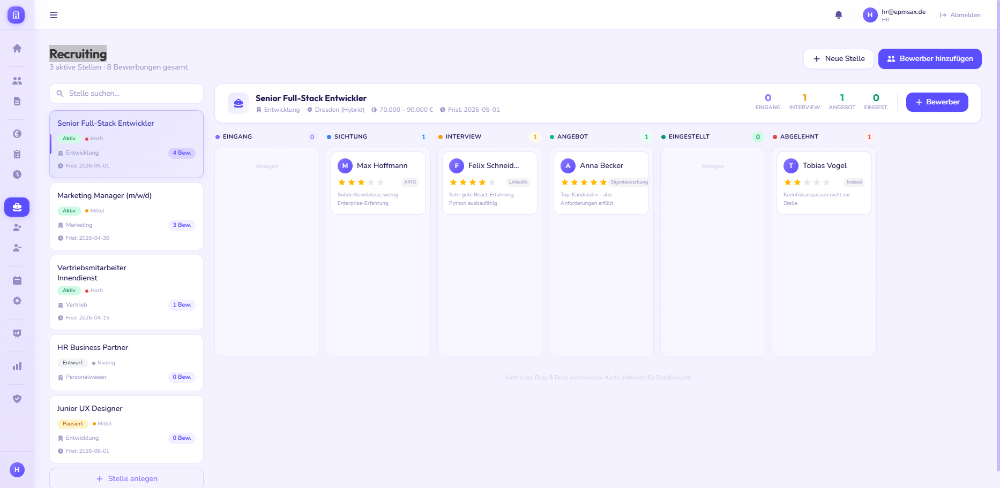
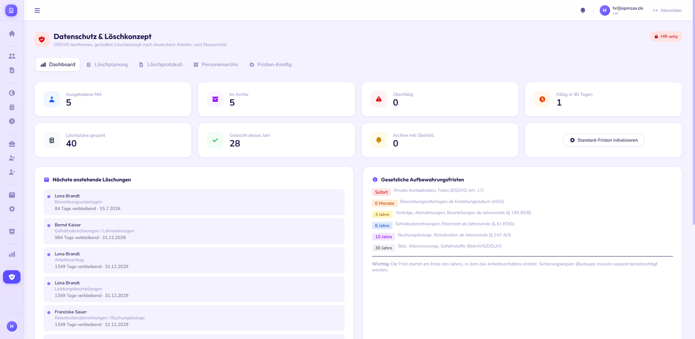
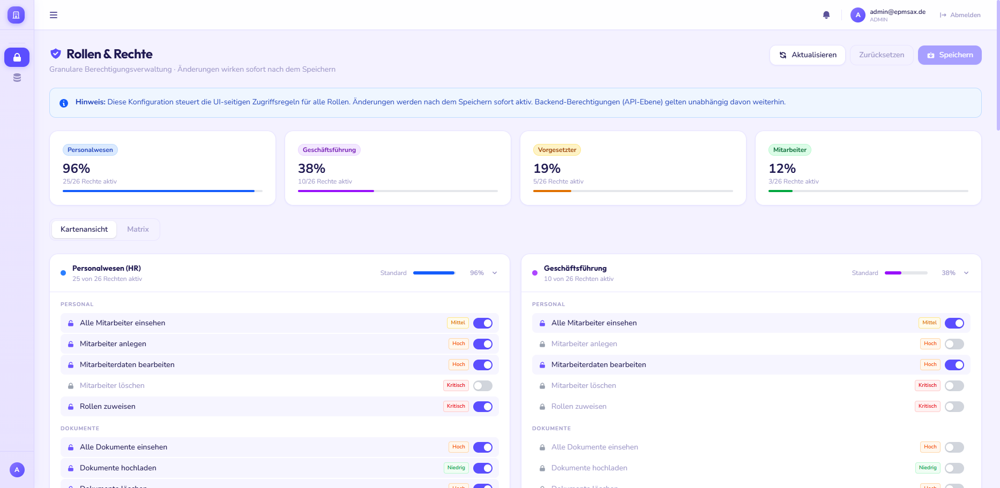

# ePM.SAX 🧑‍💼

⚠️ **WORK IN PROGRESS**

Dieses Projekt befindet sich aktuell in aktiver Entwicklung und ist noch nicht produktionsreif.

🔐 **Hinweis:** ePM.SAX ist eine proprietäre HR-Management-Plattform.

---

## 🌍 Enterprise Personnel Management System

### Moderne HR-Prozesse – effizient, datengetrieben und skalierbar

ePM.SAX ist eine zentrale Plattform zur Digitalisierung und Optimierung von Personalprozessen innerhalb von Unternehmen.

Das System ermöglicht die strukturierte Verwaltung von Mitarbeitern, Abwesenheiten, Recruiting-Prozessen sowie datengetriebene HR-Analysen in einer einheitlichen Oberfläche.

Durch eine klare Architektur, Automatisierung und moderne Webtechnologien reduziert ePM.SAX manuellen Aufwand, verbessert Entscheidungsprozesse und erhöht die Transparenz im gesamten HR-Lifecycle.

---

## 💡 Motivation

Viele bestehende HR-Systeme sind:

* schwerfällig und komplex
* wenig benutzerfreundlich
* schlecht integriert
* unflexibel bei wachsenden Anforderungen

**ePM.SAX wurde entwickelt, um genau diese Probleme zu lösen.**

Ziele der Plattform:

* ⚡ Automatisierung von HR-Prozessen
* 📊 Datengetriebene Entscheidungen
* 🧾 Zentrale Verwaltung aller Mitarbeiterdaten
* 🔐 Sichere und skalierbare Architektur
* 🔍 Transparenz in allen Personalprozessen
* 🧩 Modular erweiterbar für individuelle Anforderungen

---

## ✨ Features

* 👤 Mitarbeiterverwaltung
* 🗓️ Abwesenheitsmanagement
* 📊 HR Analytics Dashboard
* 🧾 Reporting & Auswertungen
* 🧲 Recruiting Management
* 🔐 Rollen- und Rechteverwaltung
* 🗑️ Soft-Deletion Konzept
* 🔄 Hintergrundverarbeitung mit Celery
* ⚡ Caching mit Redis
* 📦 Skalierbare Microservice-Architektur

---

## 🧠 Core Komponenten

### 🔐 Login

---

### 📊 Dashboard

---

### 👥 Mitarbeiter & Abwesenheiten

---

### 📈 HR Analytics

---

### 📊 Reports

---

### 🧲 Recruiting

---

### 🗑️ Deletion Konzept

---

### 🔐 Rollen & Rechte

---

## 🧱 Architektur

Das System basiert auf einer containerisierten Microservice-Architektur:

* **Frontend** – Benutzeroberfläche
* **Backend (Django + Gunicorn)** – API & Business Logic
* **PostgreSQL** – relationale Datenbank
* **Redis** – Cache & Message Broker
* **Celery Worker & Beat** – Hintergrundjobs
* **Nginx** – Reverse Proxy & Static Serving

---

---

## 🏗 Roadmap

* Erweiterte HR-Analytics
* KI-gestützte Recruiting-Features
* API-Integrationen (z. B. Payroll-Systeme)
* Mobile Optimierung
* Erweiterte Audit-Logs
* Multi-Tenant-Fähigkeit

---

## ❤️ Credits

ePM.SAX wurde entwickelt, um eine moderne, performante und skalierbare Lösung für HR-Management bereitzustellen – mit Fokus auf Effizienz, Automatisierung und datengetriebene Entscheidungen.
